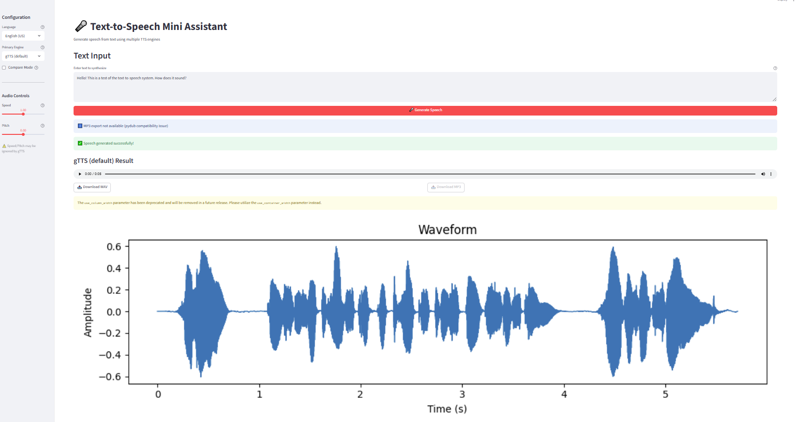

# TTS Mini Assistant 🎤

A modern Text-to-Speech (TTS) application with multiple engines, interactive web interface, and comprehensive testing. Perfect for portfolio projects and learning TTS technologies.

## Project Overview

Text-to-Speech (TTS) Mini Assistant provides multiple TTS engines with simple
utilities to save audio (WAV/MP3) and visualize waveforms. It includes optional
smoke tests for different TTS engines.


[](https://www.python.org/downloads/)
[](https://www.python.org/downloads/)
[](https://streamlit.io/)
[](https://pytest.org/)

## Features

- **gTTS (Google Text-to-Speech)** - Default engine, Python 3.13+ compatible
- **OpenAI TTS** - Optional API-based engine (requires OPENAI_API_KEY)
- **Coqui TTS** - Optional local engine (not supported on Python 3.13+)
- WAV/MP3 export
- Waveform PNG generation
- ✔ Round-trip audio fidelity validated by tests

## Tech Stack

- Python, Streamlit, gTTS, OpenAI, Coqui TTS, PyDub, SoundFile, Matplotlib, NumPy

## Installation

Requires Python 3.10+.

### Environment Variables

Copy `.env.example` to `.env` and configure:

```bash
cp .env.example .env
# Edit .env and add your OpenAI API key if using OpenAI TTS
```

**Optional:** `OPENAI_API_KEY` - Required for OpenAI TTS engine 

**Note:** Python 3.13 users: MP3 export is disabled due to pydub compatibility issues. WAV export and waveform generation work normally. gTTS is the default engine and works on Python 3.13+. Coqui TTS is not supported on Python 3.13+ and will show a clear error message.

### Quick Setup

**Windows:**
```bash
cd tts-mini-assistant
scripts\setup_venv.bat
```

**Unix/macOS:**
```bash
cd tts-mini-assistant
chmod +x scripts/setup_venv.sh
./scripts/setup_venv.sh
```

### Manual Setup

```bash
cd tts-mini-assistant
python -m venv .venv
.venv\Scripts\activate  # Windows
# source .venv/bin/activate  # Unix/macOS
pip install -r requirements.txt
```

## Environment & Tests

### Preflight Checks

Run environment checks:
```bash
python scripts/preflight.py
```

This verifies:
- Python version (3.10+)
- Core packages (soundfile, pydub, matplotlib, numpy, pytest, streamlit, gTTS)
- Optional packages (coqui-tts, openai)
- ffmpeg availability (for MP3 export)

### Running Tests

**Basic tests (no TTS):**
```bash
pytest -q
```

**TTS smoke test (optional, requires internet):**
```bash
RUN_TTS_TEST=1 pytest -q -k test_gtts
```

**Using Makefile shortcuts:**
```bash
make install && make preflight && make test
```

**Cross-platform activation:**
```bash
make activate-unix   # Shows Unix/macOS activation command
make activate-win    # Shows Windows activation command
```

### MP3 Support

MP3 export requires `ffmpeg` and `pydub`. Install if missing:

- **Ubuntu/Debian:** `sudo apt-get install ffmpeg`
- **macOS:** `brew install ffmpeg`
- **Windows:** `choco install ffmpeg`

**Note:** Python 3.13 users: MP3 export is disabled due to pydub compatibility issues. Tests will skip MP3 assertions automatically. gTTS is the default engine and works on Python 3.13+.

## Streamlit UI

Launch the interactive web interface:

```bash
streamlit run src/app.py
```

### Features

- **Language Selection**: English (US/UK) and Turkish
- **Engine Selection**: gTTS (default), OpenAI (API), Coqui (local)
- **Compare Mode**: Compare two engines side-by-side
- **Audio Controls**: Speed and pitch sliders (may not affect gTTS)
- **Download Options**: WAV and MP3 files
- **Waveform Preview**: Visual representation of generated audio

### Limitations

- gTTS requires internet connection and doesn't truly switch accents between US/UK
- Coqui may not be available on Python 3.13+
- Coqui TTS sample rate is assumed 22050 Hz (may differ per model)
- MP3 export requires ffmpeg
- OpenAI requires API key in environment

### Screenshot



*Screenshot shows the Streamlit interface with language selection, engine options, and audio controls.*

**Note:** Replace this with a real screenshot before publishing.

## Usage (Backend Scripts)  

Minimal example to synthesize speech and save outputs:

```python
from pathlib import Path
from src.tts_service import get_tts
from src.audio_utils import save_wav, save_mp3, plot_waveform

# Use gTTS (default, works on Python 3.13+)
svc = get_tts(engine="gtts", default_lang="en")
audio, sr = svc.synthesize("Hello from TTS", language="en")

out_wav = save_wav(audio, sr, Path("out/hello.wav"))
out_png = plot_waveform(audio, sr, Path("out/hello.png"))
print(out_wav, out_png)

# Note: MP3 export may be disabled on Python 3.13+
try:
    out_mp3 = save_mp3(audio, sr, Path("out/hello.mp3"))
    print(out_mp3)
except RuntimeError as e:
    print(f"MP3 export not available: {e}")
```

### Audio Pipeline

The audio utilities include input validation to ensure:
- Audio data is `float32` numpy arrays
- Audio is mono (1-dimensional)
- Sample rate is a positive integer
- Clear error messages for invalid inputs

## Tests

Run tests with `pytest`.

- **Unit and smoke tests** (no network required):

```bash
pytest -q
```

- **System verification** in `tests/test_system_verification.py` (architecture, files, API consistency)
- **UI smoke test** in `tests/test_ui.py` (imports and mapping functions)
- **Audio edge cases** in `tests/test_audio.py` (short audio, different sample rates)
- **TTS smoke test** (optional, requires internet):

```bash
RUN_TTS_TEST=1 pytest -q -k test_tts
```

**Online E2E test** (optional, requires internet):
```bash
RUN_E2E_ONLINE=1 pytest -q -k test_online_e2e_gtts
```

**Test Markers:**
- `@pytest.mark.smoke` - Lightweight smoke tests
- `@pytest.mark.tts` - Network or model dependent TTS tests

**Edge Case Coverage:**
- Empty/whitespace text validation
- Long text handling (>1000 chars)
- Unicode text with Turkish diacritics
- Very short audio processing (0.05s)
- Different sample rates (22kHz, 48kHz)
- MP3 export with ffmpeg availability checks
- System architecture verification (files, API consistency, repo hygiene)

Notes:
- gTTS requires internet connection for synthesis.
- OpenAI TTS requires OPENAI_API_KEY environment variable.
- Coqui TTS may download models on first use (requires internet).
- Coqui TTS is not supported on Python 3.13+ and will show a clear error message.
- All engines validate empty text input and show clear error messages.
- Speed and pitch parameters may be ignored by some engines (gTTS, OpenAI).
- Optionally enable TR test by adapting the example in `tests/test_tts.py`.

## Roadmap

- ✅ Add Streamlit UI for interactive TTS and audio preview
- 🔄 Add more TTS engines (Azure, AWS Polly)
- 🔄 Add voice cloning capabilities
- 🔄 Add batch processing for multiple texts
- 🔄 Add audio post-processing effects

## Quick Start 🚀

1. **Clone and setup:**
```bash
git clone <your-repo-url>
cd tts-mini-assistant
python -m venv .venv
.venv\Scripts\activate  # Windows
# source .venv/bin/activate  # Unix/macOS
pip install -r requirements.txt
```

2. **Run the app:**
```bash
streamlit run src/app.py
```

3. **Open in browser:** http://localhost:8501

## License

MIT License - feel free to use this project for learning and portfolio purposes.

---

## Polish Pack v1

This release includes final polish improvements: error message consistency, audio round-trip validation, Coqui SR notes, and repo cleanup.

A real screenshot should be added before publishing.

